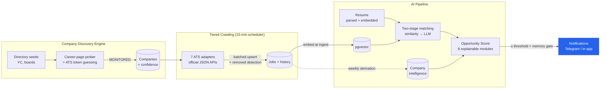

# CareerOS

**A personal AI recruiter.** CareerOS continuously discovers companies across the internet,
monitors their career pages around the clock, scores every new opportunity against your resume
with explainable reasoning, and notifies you within minutes of a matching job going live —
so you never miss an opportunity.

> Not a job board. Job boards wait for you to search. CareerOS hunts.

## What it does today

- **Company Discovery Engine** — grows its own company database: directory seeds (YC),
  board flywheel, career-page probing, ATS-token guessing verified against live ATS APIs.
  Every discovered company converts toward *permanently monitored* (current conversion: 40%,
  quality seeds 50%).
- **7 ATS integrations** via official JSON APIs: Greenhouse, Lever, Ashby, Workable,
  SmartRecruiters, Recruitee, Breezy — tiered monitoring (30min/4h/24h) with removed-job
  detection and full history.
- **Resume intelligence** — structured parsing (with a multimodal fallback for PDFs whose text
  layer is broken), canonical skill graph, semantic embeddings.
- **Two-stage AI matching** — pgvector similarity across the whole corpus, LLM deep-scoring of
  top candidates, honest reasoning ("major seniority mismatch" included).
- **Opportunity Score** — 8 explainable modules (resume fit, freshness, experience, remote/
  salary preference, company quality, hiring velocity, skill gap) with verification gating.
- **Notifications with memory** — Telegram/in-app, official apply links only, never the same
  job twice unless it materially improves, and `GET /matches/why/:jobId` explains any decision.
- **Company intelligence** — tech stack, role mix, seniority profile, salary medians, hiring
  velocity/trend, derived from its own job corpus.

## Architecture



Three deployable units (modular monolith — see [ADR-1](docs/DECISIONS.md)): **API** (NestJS —
owns the schema, runs AI processors), **workers** (Node — crawling, discovery, scheduling),
**scraper** (Python — hard targets, Phase D). Postgres+pgvector, Redis+BullMQ, MinIO.

## Documentation

| Doc | What |
|---|---|
| [docs/DECISIONS.md](docs/DECISIONS.md) | Architecture Decision Records (10 ADRs) |
| [docs/ARCHITECTURE_REVIEW.md](docs/ARCHITECTURE_REVIEW.md) | Bottleneck audit + roadmap rationale |
| [docs/SCALE_100K.md](docs/SCALE_100K.md) | "What breaks first at 100k users?" |
| [docs/VISION.md](docs/VISION.md) | Product vision & feature map |
| [docs/PHASE4_CRAWLER.md](docs/PHASE4_CRAWLER.md) | Discovery/crawl design |
| [docs/PROJECT_LOG.md](docs/PROJECT_LOG.md) | Full build journal, bugs and all |
| [docs/DEPLOY.md](docs/DEPLOY.md) | VPS deployment runbook |
| [docs/NEW_MACHINE_SETUP.md](docs/NEW_MACHINE_SETUP.md) | Dev environment setup |

## Quick start (development)

```bash
npm install
npm run docker:up                                # Postgres+pgvector, Redis, MinIO
npm run build --workspace=@careeros/shared
cd apps/api && cp .env.example .env              # fill in GEMINI_API_KEY
npx prisma migrate deploy && npm run start:dev   # API :3001
cd ../workers && cp .env.example .env && npm run dev
```

Production: see [docs/DEPLOY.md](docs/DEPLOY.md) — `compose.prod.yml` runs the whole stack.

## Numbers (one laptop, free tier, first week)

160 monitored companies · 4,500+ active jobs · 40% discovery→monitored conversion ·
27 unit tests · CI with Docker builds · $0 spent.
